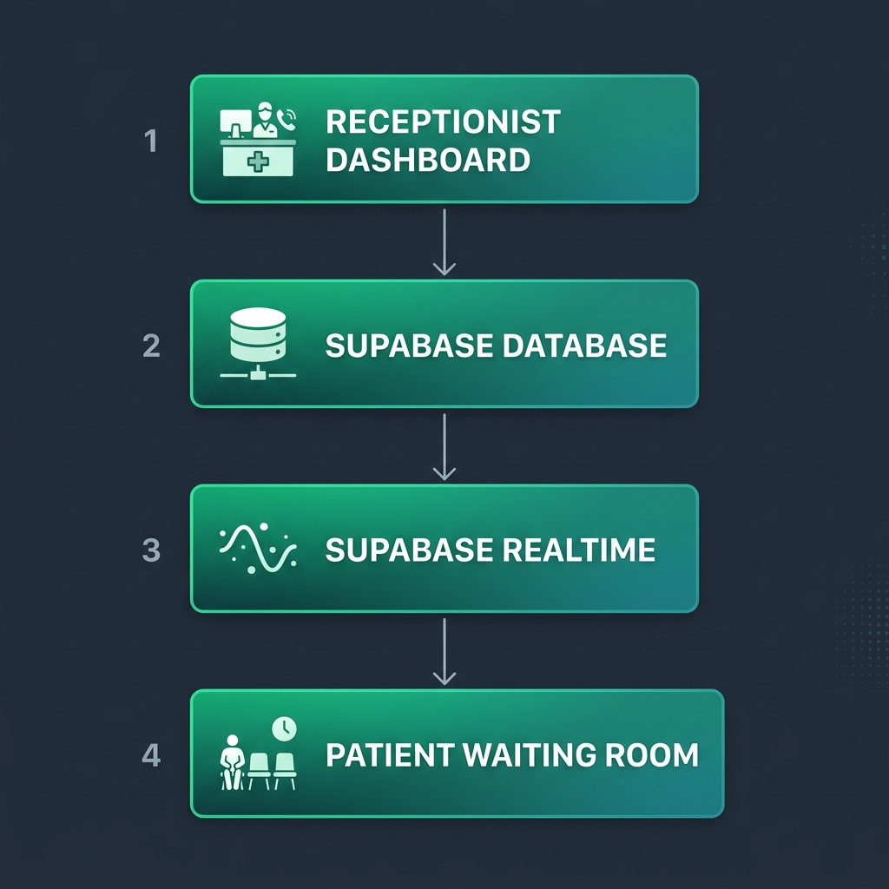
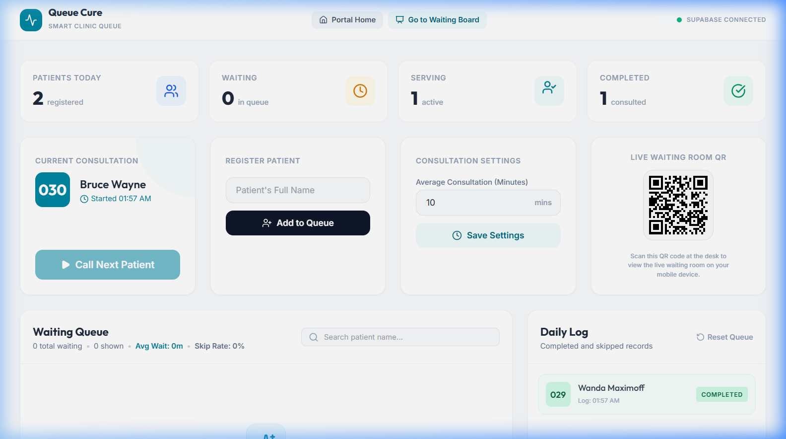
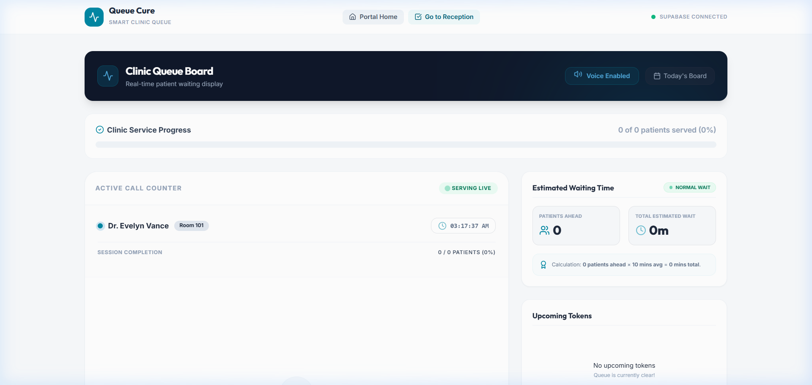

# 🩺 Queue Cure

[](https://vercel.com/new/clone?repository-url=https://github.com/ghosttech07/queue-cure)
[](https://queue-cure-psi.vercel.app)

Queue Cure is a premium, real-time healthcare queue management platform designed to optimize clinical workflows and enhance patient wait-time transparency.

---

## 🚀 Deploy to Vercel (One Click)

1. Click **Deploy with Vercel** above
2. Connect your GitHub account
3. Add these **Environment Variables** in the Vercel dashboard:

| Variable | Value |
|---|---|
| `VITE_SUPABASE_URL` | Your Supabase project URL |
| `VITE_SUPABASE_ANON_KEY` | Your Supabase anon key |

4. Click **Deploy** — done!

> ⚠️ Without the env vars set in Vercel, the app will fail to connect to the database.

---

## 📌 Problem Statement
Over **76% of clinics** still rely on legacy paper token systems. Patients suffer from anxiety due to a complete lack of visibility into real-time wait times, and receptionists are burdened with managing lines, skipped turns, and manual updates.

## 💡 Solution
**Queue Cure** resolves these frictions by introducing a direct, serverless, real-time synchronization pipeline between the receptionist and patients. Patients scan a desk QR code to track their position live on their mobile screens, while the receptionist dashboard automates patient calling, skipping, and session tracking.

---


## 🏗️ Architecture
The system is built on a direct realtime state-sync architecture, mapping mutations instantly between active client roles.



```
Receptionist Dashboard
        │
        ▼
  Supabase Database
        │
        ▼
 Supabase Realtime
        │
        ▼
Patient Waiting Room
```

---

## 🌟 Features
- **Add Patients**: Seamless patient registration form with dynamic field validation.
- **Auto Token Generation**: Automatic token numbering (`Token 001`, `Token 002`) calculated from queue history.
- **Real-Time Queue Updates**: Instant layout refreshes across all screens using PostgreSQL realtime channel subscriptions.
- **Wait Time Estimation**: Dynamic wait calculations displaying patients ahead, total minutes, and wait severity tags (🟢 Normal Wait, 🟡 Moderate Wait, 🔴 Long Wait).
- **QR Code Access**: Scan-to-track desk QR code displays on both screens to view live board queues on mobile.
- **Voice Announcements**: Browser-native SpeechSynthesis audio calls ("Token X, please proceed...").
- **Analytics Dashboard**: High-level metrics tracking Patients Today, Waiting, Serving, and Completed consultations.
- **Mobile Responsive UI**: Fully responsive columns designed for large waiting-room TVs and patient smartphones.

---

## 🛠️ Tech Stack
- **Frontend**: React, Tailwind CSS, Lucide Icons, Vite
- **Database / Backend**: Supabase, PostgreSQL Realtime Channel
- **Hosting / Distribution**: Express static server hosting the compiled SPA

---

## 🚀 Installation & Local Run

### Prerequisites
- Node.js (v18+)

### Step-by-Step Run

1. **Clone the repository and install dependencies**:
   ```bash
   cd "Queue cure"
   npm install
   ```
2. **Configure Environment Variables**:
   Create a `.env` file inside `frontend/` with your Supabase credentials:
   ```text
   VITE_SUPABASE_URL=https://<your-project-ref>.supabase.co
   VITE_SUPABASE_ANON_KEY=<your-anon-key>
   ```
3. **Run Development Mode**:
   ```bash
   npm run dev
   ```
4. **Compile & Run Unified Server (Production Mode)**:
   ```bash
   # Build static assets
   npm run build
   
   # Start the production static server
   npm start
   ```

---

## 🗄️ Database SQL Schema
Execute this SQL script in your **Supabase Dashboard > SQL Editor** to construct the tables:

```sql
-- 1. Create patients table
CREATE TABLE public.patients (
    id UUID DEFAULT gen_random_uuid() PRIMARY KEY,
    name TEXT NOT NULL,
    token_number SERIAL UNIQUE,
    status TEXT DEFAULT 'waiting' CHECK (status IN ('waiting', 'serving', 'completed', 'skipped')),
    created_at TIMESTAMPTZ DEFAULT now(),
    called_at TIMESTAMPTZ,
    completed_at TIMESTAMPTZ
);

-- Enable Realtime
ALTER PUBLICATION supabase_realtime ADD TABLE public.patients;

-- 2. Create queue_config table
CREATE TABLE public.queue_config (
    id INT8 PRIMARY KEY DEFAULT 1,
    average_consultation_time INT8 DEFAULT 10
);

-- Enable Realtime
ALTER PUBLICATION supabase_realtime ADD TABLE public.queue_config;

-- Initialize config row
INSERT INTO public.queue_config (id, average_consultation_time)
VALUES (1, 10)
ON CONFLICT (id) DO NOTHING;

-- Disable Row Level Security (RLS) for testing
ALTER TABLE public.patients DISABLE ROW LEVEL SECURITY;
ALTER TABLE public.queue_config DISABLE ROW LEVEL SECURITY;

-- Grant permissions to anon role
GRANT ALL ON TABLE public.patients TO anon;
GRANT ALL ON TABLE public.patients TO authenticated;
GRANT ALL ON TABLE public.patients TO service_role;

GRANT ALL ON TABLE public.queue_config TO anon;
GRANT ALL ON TABLE public.queue_config TO authenticated;
GRANT ALL ON TABLE public.queue_config TO service_role;

GRANT USAGE, SELECT ON SEQUENCE public.patients_token_number_seq TO anon;
GRANT USAGE, SELECT ON SEQUENCE public.patients_token_number_seq TO authenticated;
GRANT USAGE, SELECT ON SEQUENCE public.patients_token_number_seq TO service_role;

NOTIFY pgrst, 'reload schema';
```

---

## 🔮 Future Improvements
- **Multi-Doctor Support**: Support multiple consultation rooms (Room 101, Room 102) and active queues concurrently.
- **SMS Notifications**: Trigger automated SMS alerts when a patient is next in line.
- **Appointment Scheduling**: Bridge scheduled bookings with the live walk-in queue.

---

## 📸 Screenshots

### Receptionist Dashboard


### Patient Waiting Room


### Architecture


---

## 📄 Documentation

- [📐 Architecture Diagram](./docs/architecture.png)
- [📸 Dashboard Screenshot](./docs/dashboard.png)
- [📸 Waiting Room Screenshot](./docs/waiting-room.png)
- [💡 Thought Process Sheet](./docs/thought-process.md)
